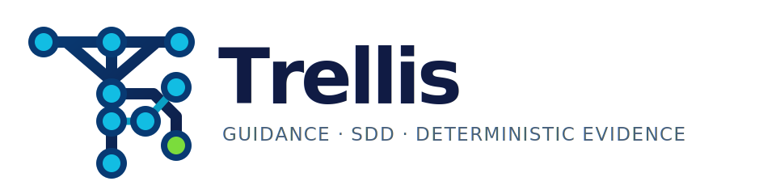
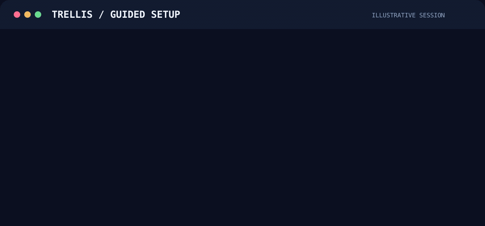
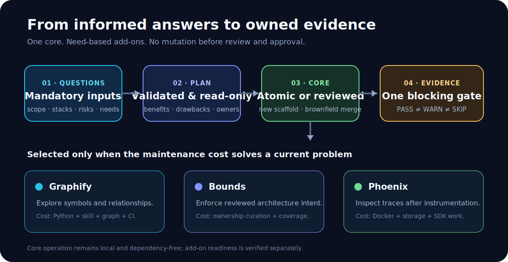
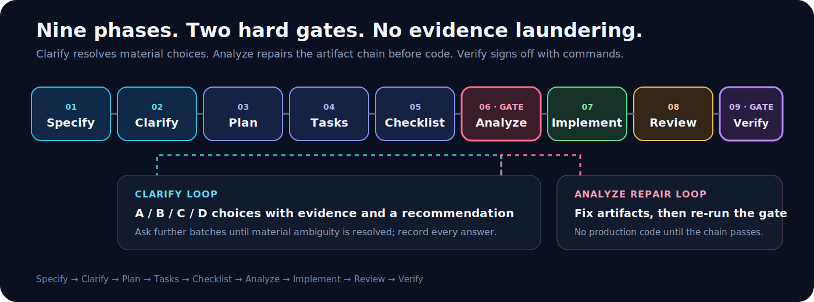

<div align="center">
  <picture>
    <source media="(prefers-color-scheme: dark)" srcset="./assets/brand/trellis-wordmark-dark.svg">
    
  </picture>

  <p><strong>Give coding agents a durable way to understand the work, make decisions, and prove what actually ran.</strong></p>

  <p>
    <a href="https://github.com/Farzin312/trellis/actions/workflows/ci.yml"></a>
    <a href="https://nodejs.org/en/about/previous-releases"></a>
    <a href="./LICENSE"></a>
    <a href="./package.json"></a>
  </p>
</div>

Trellis is a source-distributed, repository-local toolkit for AI coding agents.
It keeps operating rules, reusable Agent Skills, a nine-phase spec-driven
workflow, structural orientation, and deterministic evidence with the code they
govern. It is deliberately not a hosted agent runtime, model router, IDE, or
promise that generated code is correct.

<picture>
  <source media="(prefers-reduced-motion: reduce)" srcset="./assets/readme/setup-demo.png">
  
</picture>

The animation is an illustrative transcript, not captured proof. Images are explanatory; the commands and text are authoritative.

## What Trellis does

- **Carries agent guidance with the repository.** `AGENTS.md` is the durable
  cross-agent mandate. Reusable workflows live in `.agents/skills/`; only the
  required `.claude/skills/` compatibility mirror is generated.
- **Turns vague work into an auditable delivery chain.** Specify, Clarify, Plan,
  Tasks, Checklist, Analyze, Implement, Review, and Verify each own an artifact
  and a directly invocable Agent Skill.
- **Makes missing evidence visible.** `trellis eval` runs required toolkit tests
  plus one project-owned `check:project` gate or conservative language-test
  fallbacks. `PASS`, `FAIL`, `WARN`, and `SKIP` remain distinct.
- **Maps a repository cheaply.** `trellis map` provides a bounded, read-only
  structural overview without an LLM, cache, credential, or optional tool.
- **Adds architecture and observability only when justified.** Graphify, Bounds,
  and Phoenix are explicit add-ons with separate prerequisites and ownership.
- **Protects adopters from fake automation.** New scaffolds publish atomically;
  unrelated existing repositories use a reviewed merge rather than a blind
  overwrite.

Trellis provides workflow and verification infrastructure. It does not install
application dependencies. Trellis does not configure application authentication,
authorization, secrets, payments, database policy, or deployment. Those trust
boundaries remain project-owned and must fail closed.

## The product model

There is one Trellis core. “Profiles” are recommendations over explicit add-ons,
not divergent lite/pro/full packages:

| Layer | Use it for | Cost you accept |
|---|---|---|
| **Trellis Core** | Agent guidance, SDD, project gates, docs integrity, and structural mapping | Supplying real project scope, risks, and application commands |
| **Graphify** | Deeper symbol and relationship traversal | Python CLI, project skill, generated graph, and CI upkeep |
| **Bounds** | Reviewed ownership, blast radius, and boundary enforcement | Curated manifests, complete coverage, and deliberate re-baselining |
| **Phoenix** | Local trace inspection after instrumentation | Docker, ports, storage, and project-owned telemetry code |



Core is the default. An add-on earns its place only when its maintenance cost
solves a current problem.

## Guided setup

Trellis exposes one mandatory questionnaire and a read-only plan renderer:

```bash
trellis setup questions
trellis setup questions --json
trellis setup plan --answers=/tmp/trellis-answers.json
```

The plan validates project identity, scope, stacks, risk surfaces, project-gate
status, add-on needs, dependency policy, and trade-off acknowledgement. It
performs no writes. Missing or contradictory answers stop the flow.

Dependency authority is recorded per add-on, so an already-installed Graphify
CLI can be verified while a separate Docker installation remains unapproved or
explicitly approved.

- **[AI-assisted setup](docs/AI-SETUP.md):** copy one prompt into a coding agent.
  It asks every mandatory question in sequence, inspects read-only, validates the
  plan, explains benefits and drawbacks, waits for final approval, then executes
  and verifies the approved work.
- **[Manual setup](docs/manual-setup.md):** use the same questions, plan, pinned
  dependency decisions, and completion contract without an LLM.

Existing repositories always follow the
[brownfield adoption guide](docs/adopting-existing-projects.md). Package scripts,
mandates, README files, licenses, CI, hooks, and documentation already have
owners; a universal auto-merge would be destructive, not convenient.

## Prerequisites and support

Core use requires:

- Git;
- Node.js 22 or newer on a currently supported LTS line;
- npm;
- Bash on macOS or Linux (Windows users need WSL);
- at least one compatible coding agent to invoke Agent Skills.

Core setup, help, mapping, checks, and documentation verification need no LLM
credential or paid service. Graphify and Bounds require Python 3.10+ plus `uv`
or `pipx`; Phoenix requires Docker. Graphify can index supported code locally,
while richer document extraction can require a provider credential.

The release checks run locally on macOS and in Ubuntu CI. WSL uses the Linux
path; native PowerShell, `cmd.exe`, and Git Bash initialization are not
CI-tested or claimed.

Compatibility reviewed: 2026-07-11.

| Agent surface | Trellis path | Status and source |
|---|---|---|
| Codex | `.agents/skills/` and `AGENTS.md` | Native project paths; [OpenAI skill guide](https://learn.chatgpt.com/docs/build-skills) |
| OpenCode | `.agents/skills/` and `AGENTS.md` | Native shared path; [OpenCode Agent Skills](https://opencode.ai/docs/skills/) |
| GitHub Copilot | `.agents/skills/` and `AGENTS.md` | Supported project path; [GitHub Agent Skills](https://docs.github.com/en/copilot/concepts/agents/about-agent-skills) |
| Claude Code | `.claude/skills/` and `CLAUDE.md` | Generated compatibility files; [Claude Code skills](https://code.claude.com/docs/en/skills) |

Trellis tests manifest detection and fallback command dispatch for generic,
JavaScript/TypeScript, Python, Go, and Rust projects. Other stacks retain the
language-neutral core and wire a project-owned gate manually. See
[language support](docs/language-support.md).

## Install

The current distribution is a source checkout. It is not advertised as an npm
registry release.

```bash
git clone https://github.com/Farzin312/trellis.git
cd trellis
npm ci --ignore-scripts
npm install -g .
trellis --version
```

`npm install -g .` exposes the executable from the reviewed checkout. To avoid a
global link, invoke `node .trellis/cli.mjs` from the Trellis source directory.

Create a clean project:

```bash
trellis new my-project --stack=typescript
cd my-project
npm ci --ignore-scripts
npm run check
```

Configure a checkout that already contains a reviewed Trellis payload:

```bash
trellis init "My Project" --stack=typescript
```

As soon as application code has real build, lint, type, test, migration,
browser, or integration commands, place them behind one `check:project` package
script. The aggregate runs it exactly once and blocks recursive Trellis wrappers.

Add `--with-graphify` or `--with-bounds` only after the selected tool, generated
state, and CI installation are ready. Enablement makes missing readiness a
blocking project-wide check; it does not install the tool.

## First successful workflow

Open the project in a compatible agent and ask:

```text
Use the speckit-specify skill to specify: Add a password reset flow.
```

Then follow this exact order:

```text
Specify -> Clarify -> Plan -> Tasks -> Checklist -> Analyze -> Implement -> Review -> Verify
```



Clarify resolves material unknowns in batches of one to three A/B/C/D questions,
each with evidence and a recommendation, and continues until material ambiguity
is closed. Analyze builds end-to-end traceability, fixes repairable artifact
gaps in their owning phase, and re-runs before any production code. Verify records
commands, exits, evidence, and external limitations.

Each phase is canonical under `.agents/skills/speckit-*/SKILL.md`. Portable
invocation is “Use the `skill-name` skill to …”; shorthand differs by agent.
Finish with:

```bash
npm run check
```

A successful process has no required failure. Optional `WARN` and `SKIP` results
remain visible and never become passed evidence.

## Understand a repository cheaply

Start with the core map:

```bash
trellis map
trellis map --json
```

It reports manifests, stacks, top-level composition, tests, extensions, and
documented systems without writing a cache or claiming semantic dependency
analysis. Configure deeper tools only when needed:

```bash
trellis config show
trellis config enable graphify
trellis config enable bounds
```

Graphify answers symbol/relationship questions. Bounds describes intended
subsystem ownership and validates drift. Their exact pinned setup, verification,
CI, and removal contracts are in
[repository mapping](docs/repository-mapping.md).

## Positioning

Trellis is for teams that want agent operating rules and evidence to travel with
the repository. Its useful differentiation is the bundle: cross-agent skills,
full SDD phase gates, mandatory guided adoption, safe scaffolding, one
project-owned evidence hook, cheap structural mapping, optional architecture
readiness, and truthful result semantics.

[GitHub Spec Kit](https://github.com/github/spec-kit) and
[OpenSpec](https://github.com/Fission-AI/OpenSpec) are credible alternatives for
spec-centered workflows. Graphify and Bounds specialize in code knowledge and
architecture enforcement. Phoenix specializes in observability. Trellis does
not pretend to replace those products; it gives a repository one conservative
control plane around the capabilities it actually adopts.

## Troubleshooting

- **`trellis` is not found:** run `npm install -g .` from the source checkout or
  use `node .trellis/cli.mjs` there.
- **Setup plan rejects answers:** run `trellis setup questions --json` and fill
  every required field; do not bypass the validator.
- **`check:project` recurses:** every reachable npm script must stay
  application-owned; direct and indirect paths to `npm test`, `npm run check`,
  `trellis check`, or `trellis eval` are rejected.
- **A configured integration fails:** follow its printed next action. A
  configured-but-missing tool or artifact is intentionally blocking.
- **An integration is skipped:** it is not configured. That skip is expected,
  not a pass.
- **A target already exists:** use a different directory for `trellis new` or
  follow the reviewed brownfield path.
- **An agent needs compact output:** append `--ai` or set `TRELLIS_AI=1`. Use
  structured command output such as `map --json` and `setup ... --json` for
  parsers.

The complete documentation map is at [docs/README.md](docs/README.md).

## License

Trellis is licensed under the [MIT License](LICENSE). Redistributed copies or
substantial portions must retain the copyright and permission notice. Optional
integrations retain their own licenses; Phoenix uses the Elastic License 2.0 and
is source-available rather than OSI-certified open source. See
[credits and licenses](docs/credits.md).

## Security

Report path traversal, command execution, secret exposure, unsafe overwrite, or
gate-bypass concerns through the [security policy](SECURITY.md). Do not place
sensitive reproduction details in a public issue.

## Contributing

Read [the contribution guide](CONTRIBUTING.md), run `npm run check`, and
review the [changelog](CHANGELOG.md) before submitting a focused pull request.
Historical fixes and active specifications are maintainer evidence, not setup
instructions.
